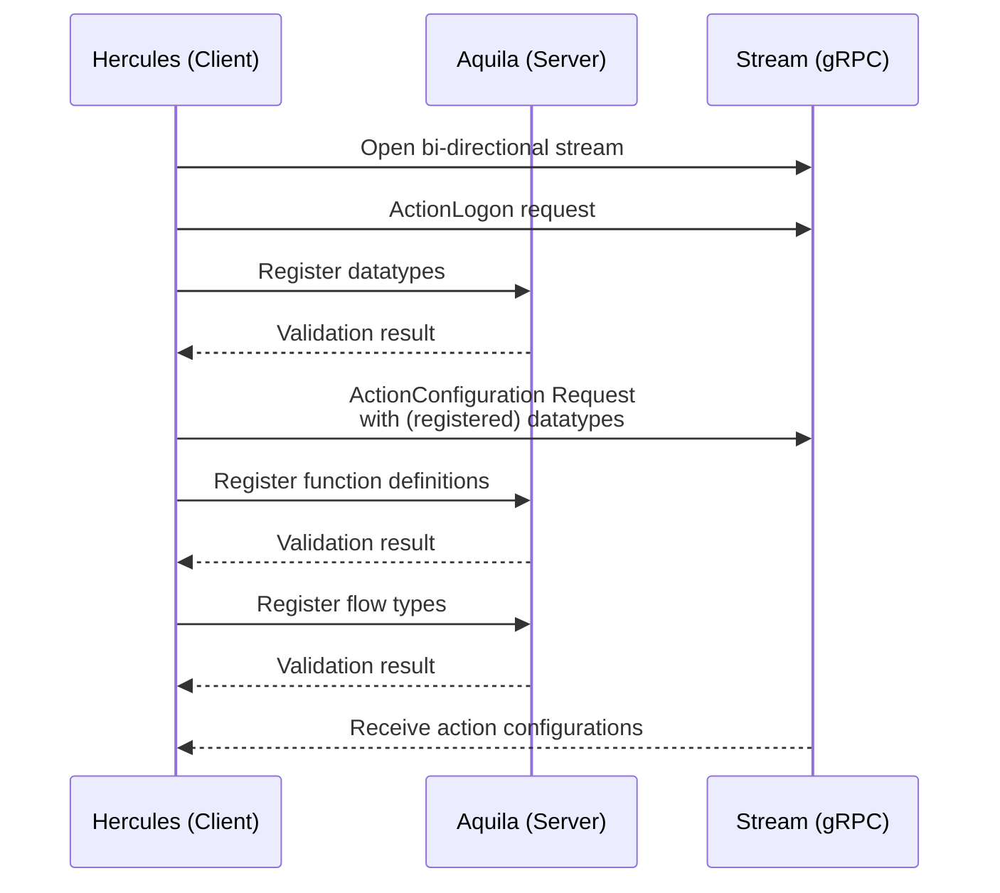
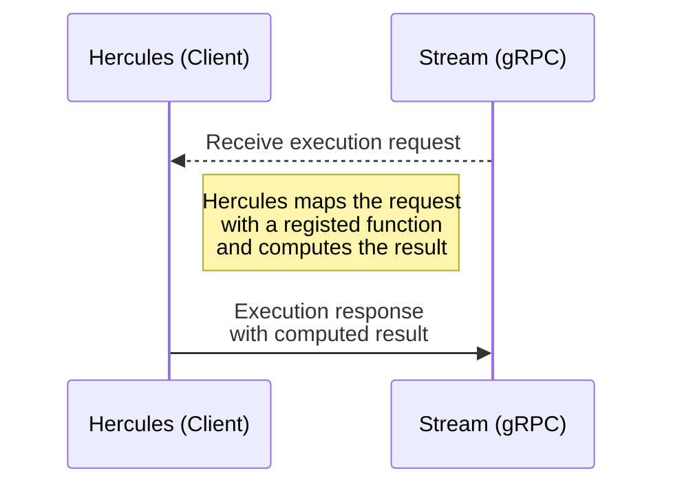
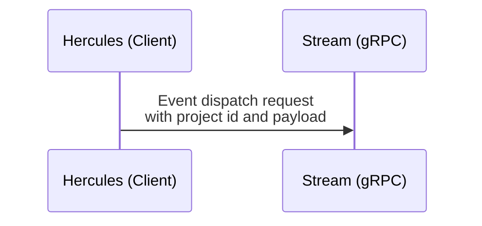

# hercules
The action sdk to connect with aquila

This action sdk is currently implemented in:
- [Typescript](./ts/README.md)

# GRPC Communcation Flow

## Connection Flow



## Function execution flow



## Event flow



# Test Server
To use a simple test server use the following command:

```bash
./bin/test_server.rb
```
This will start a test server on `localhost:50051` that you can connect to with the action sdk.